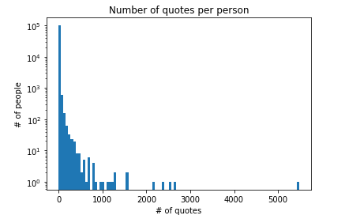

# Quote Me If You Can

Have you ever heard of [Catch Me If You Can](https://en.wikipedia.org/wiki/Catch_Me_If_You_Can) ? In this movie, the main character impersonates many professions mainly by appropriating their uniforms, specific behaviours and lingos, and everybody fall for it !  

[source](https://media1.tenor.com/images/24eba459fc0a6e19c4d2d60ed678e2f9/tenor.gif?itemid=7219821)

For the uniform it is quite obvious, but what can we say about the lingo ? One will agree that each occupation has its « proper words », but a person of a specific profession will also express himself in a certain manner. Think of a politician, she does not only speaks about economy and education, but also uses some figure of speech, and her discourse is fluid and well conducted (this might be hard to catch in a quote, but it is an example).  
From this observation, we would like to see if it is possible to guess the profession of someone based on his quotations ?

### A closer look at the dataset 

As a first step we chose to filter out any quote whose `qids`.length != 1. 
* Why ? On one hand we get rid of the "homonym issue": _James Fisher_ is not unique, which leads to many Qids. On the other hand, we deal with missing values: some speakers are "None".  By doing so, we reduce the data size by 50%. For a full year, we have in average 22 million quotes. It then remains 11 million quotes per year, which should be enough.  
Sometimes even if argmax(Probability(speaker)) < 0.5, a speaker is still assigned. We didn't care about that at first glance, since it happens that argmax(Probability(speaker)) > 0.75 but assigned speaker is wrong. 
* How ? As the data size is not fitting our RAM, we filtered out for each year "chunk by chunk" and store the result in 5 new csv files. We can work on those file by appliying the same method.

After that, we perform a first analysis on the distribution of the number of quote. We show here the distribution of the number of quotations per speaker among year 2020, for chunk 1/6. Each chunk is of size 500,000. The distribution is assumed similar for all chunks: 

By looking at this graph, we assume that the number of quotation per person is enough for our purpose. Furthermore, year 2020 has "only" 6 chunks as it finishes in april. The other years have about 20 chunks.

### Additional features

We need to relate the `speaker` feature to its profession. This can be achived by using `speaker_attributes.parquet` and `wikidata_labels_descriptions_quotebank.csv`. `speaker_attributes.parquet` has a `occupation` column, which contains one or several wiki-Qids. We will translate those into a profession using `wikidata_labels_descriptions_quotebank.csv`

### Pipeline
#### Targets
We select speakers with a sole profession (about 88% of `occupation`). This is to ensure that a quote can be related to only one occupation. The selected profession are listed, and the list is manualy boiled down by:  
 a) selecting the most typical and popular professions  
 b) combining related professions into one class (e.g. combine a “biochemistry teacher” and a “physics teacher” into a “teacher” class).
The final list is of size C+1, for C classes and an extra additional class “other” which contains the remaining professions. Finally, we convert those classes to a vector using one-hot encoding.

#### Features
The selected quotes are [lemmatized](https://pythonwife.com/lemmatization-in-nlp/) using [spaCy](https://spacy.io/) (see [alternatives](https://www.analyticsvidhya.com/blog/2020/08/top-4-sentence-embedding-techniques-using-python/)). The resulting lists are then converted to a collection of numeric vector by means of a pre-trained word vectors dictionary (e.g. from [“GloVe: Global Vectors for Word Representation”](https://nlp.stanford.edu/projects/glove/)). If a word is not in the dictionary, a vector of zeros is assigned. Finally, by summing the vectors together, we get one vector per quote. As this vector is high dimensional (dim=300), we can limit the length of the quote vector by taking only the first D values. This _could_ avoid overfitting or provoke underfitting. An optimal D could be selected through a cross validation procedure on a reduced dataset. 

#### Model
With the help of a neural network, we can link our D dimensionnal input vector to our C+1 dimensionnal output vector. Softmax is used as final activation function, after which the output values will model the probability that the quote's speaker belongs to the predicted class.

#### Train
Our "pre-processed" dataset has a `Qid` colum, D columns for the vectorized quote, C+1 columns for the corresponding one-hot label, and is of length N. In order to define both train and test sets, we follow the 80%-20% rule. The train data is loaded by batch and cross-entropy loss is chosen (classification) as an optimized function, and will evaluate the model using the test set according to the accuracy metric.
Eventually, we will take into consideration that we might encounter an unbalanced data issue, since we will have C+1 classes among the data.

### Result
What a nice model we got ! We got it because we have chosen Qids with sole profession, remember ? At this stage we could see if our model works, or not. But let's assume it works !
* Let's consider now Qids with multiple professions, we won't dive into a multiclass neural network but, by looking at the quotes of the person per year or month (depending on available data), is it possible to predict what profession the person was excercing _by this time_?
* Can we use our model to assign a word, or collection of words to a class ? 
* Can we predict another target of a speaker: other features in the provided folder "speaker_attributes.parquet" (e.g. “nationality”, “gender”, etc)?

### Planning
#### During Milestone 2
* Ivan: handle data in its size.
* Konstantin: explore additional dataset and looks for NLP methods: word emmbedings.
* Mohamed: explore feasability of alternative ideas that we finally dropped (Social quotes, graph implementation).
* David: explore NLP methods: stemming and lemmatization, redaction of Readme.md.

#### Up until Milestone 3
* Ivan, David: merge additional dataset with the quote and get the lemmatization process working.
* Mohamed, Konstantin: prepare the occupation clusters.

For this Milestone, two notebooks are presented: 

1) [Main_Processing](https://github.com/epfl-ada/ada-2021-project-k-dim/blob/main/code/Main_Processing.ipynb), which contains the work on the quotes datasets.
2) [Wikidata_dataset](https://github.com/epfl-ada/ada-2021-project-k-dim/blob/main/code/Wikidata_dataset.ipynb), which contains the work on the additional metadata on the speakers in the Quotebank dataset.
